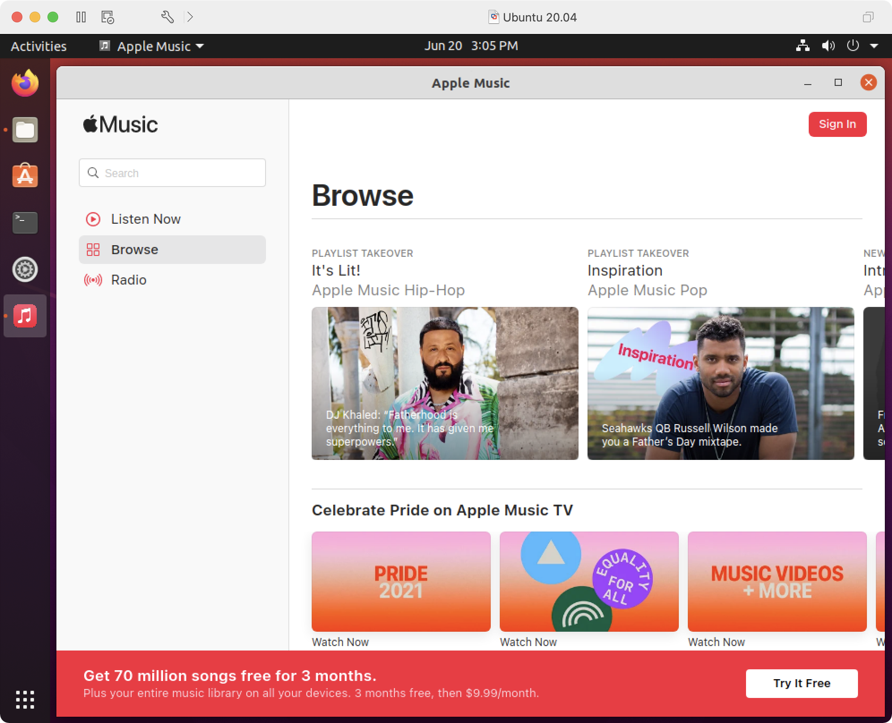
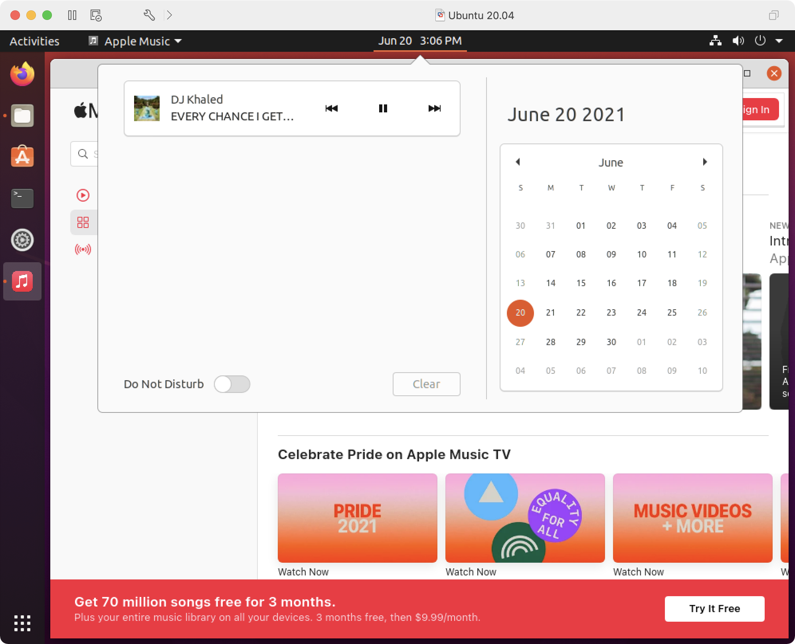
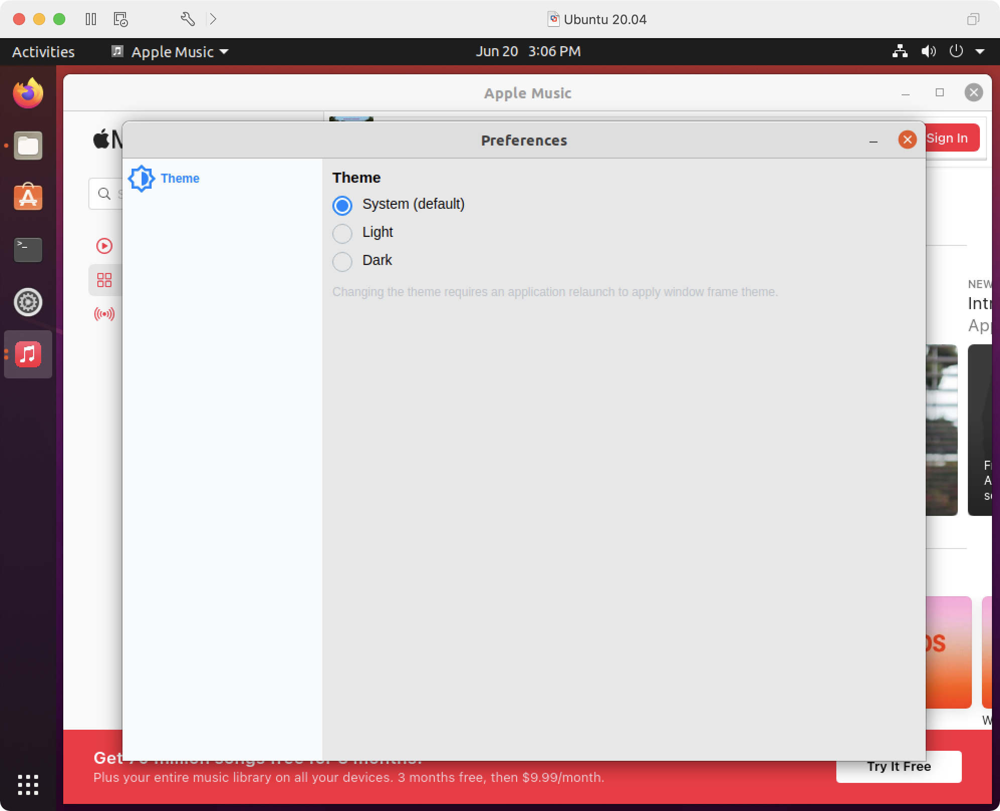
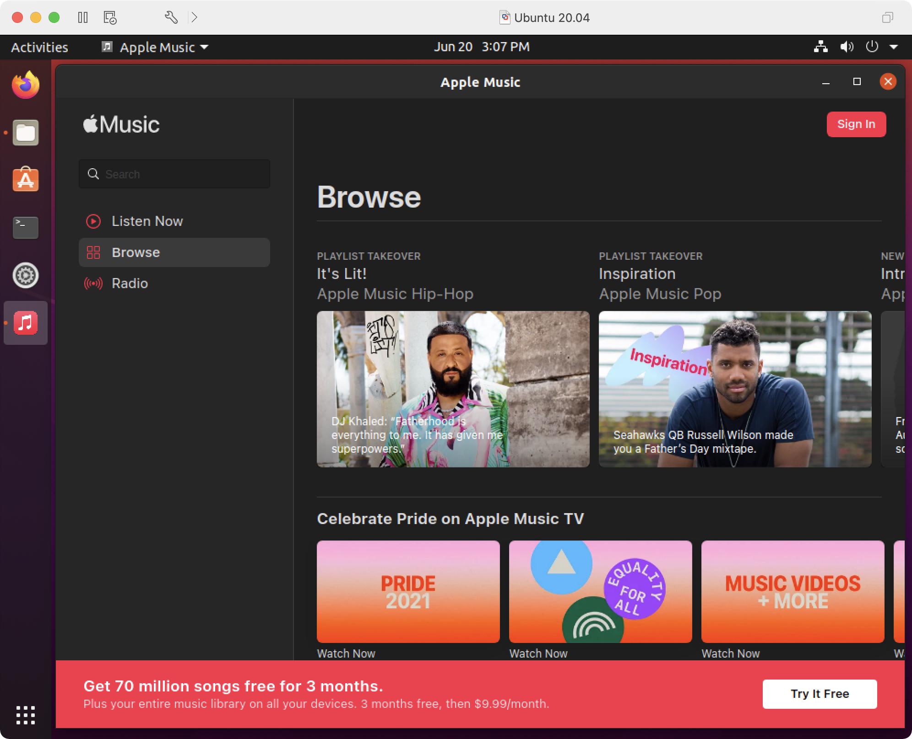
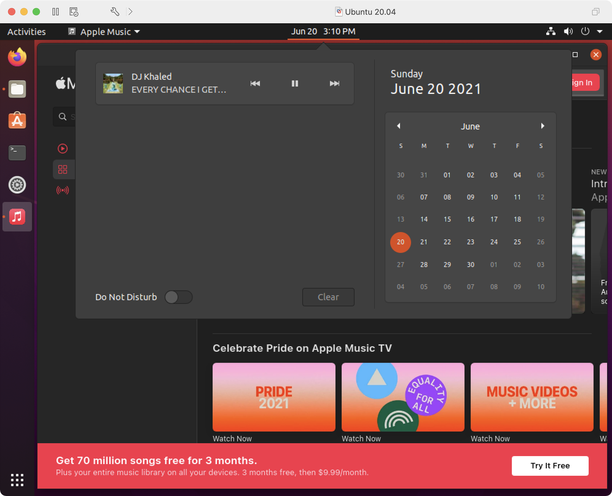

# Apple MusicMpris

Unofficial Apple Music application for Linux. It integrates with the freedesktop Mpris Dbus interface to provide external media playback controls.

Supports switching between light and dark variants in application preferences (`Ctrl`+`,`).

## Screenshots

